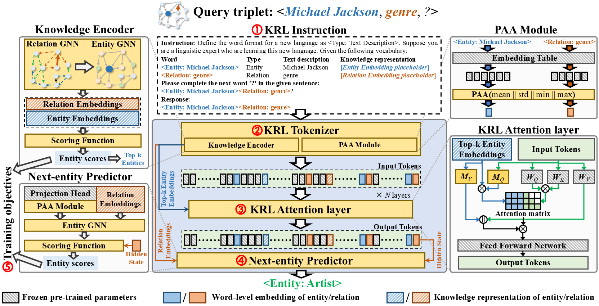

# Knowledge Reasoning Language Model: Unifying Knowledge and Language for Inductive Knowledge Graph Reasoning (ICLR 2026)
<p align="center">
  
</p>

# Simple Setup & Run for KRLM

## 1. Download model Weights and Preprocessed Data

First, download the required pre-trained LoRA weights and data from the following link:

- [Download Link](https://drive.google.com/file/d/1R4k55j2N6Xw_rPRdKX8Y6athEemZLKAl/view?usp=drive_link)

After downloading, unzip the `dataset_and_PTweight_GoogleDrive.zip` file and place the extracted files in the following directories:

- Place the `model.pth` file into the root directory of the project under `./Llama-2-7b-chat-hf_LORA`.
- Replace the `data` folder with the `./data` directory in the project.

Then, download the pre-trained LLM checkpoint, here we use [Llama-2-7b-chat-hf](https://huggingface.co/meta-llama/Llama-2-7b-chat-hf). Move the LLM checkpoint to `./llm_source`.

## 2. Create Conda Environment [Here](https://github.com/lazyloafer/KRLM/blob/main/environment.yml)

## 3. Accelerate Configuration for Multi-GPU Environment

Run the following command to configure the multi-GPU environment:

```bash
bash accelerate config
--------------------------------------------------------------------------------------------------------------------------
In which compute environment are you running?
This machine                                                                                                              
--------------------------------------------------------------------------------------------------------------------------
Which type of machine are you using?                                                                                      
multi-GPU                                                                                                                 
How many different machines will you use (use more than 1 for multi-node training)? [1]: 1                                
Should distributed operations be checked while running for errors? This can avoid timeout issues but will be slower. [yes/NO]: no
Do you wish to optimize your script with torch dynamo?[yes/NO]:no                                                         
Do you want to use DeepSpeed? [yes/NO]: no                                                                                
Do you want to use FullyShardedDataParallel? [yes/NO]: no                                                                 
Do you want to use Megatron-LM ? [yes/NO]: no                                                                             
How many GPU(s) should be used for distributed training? [1]:4                                                            
What GPU(s) (by id) should be used for training on this machine as a comma-separated list? [all]:all                      
Would you like to enable numa efficiency? (Currently only supported on NVIDIA hardware). [yes/NO]: no                     
--------------------------------------------------------------------------------------------------------------------------
Do you wish to use mixed precision?
no                                                                                                                        
accelerate configuration saved at /home/wsco/.cache/huggingface/accelerate/default_config.yaml
```

## 4. Run Training and Evaluation Scripts

```bash
accelerate launch pretrain.py
```
